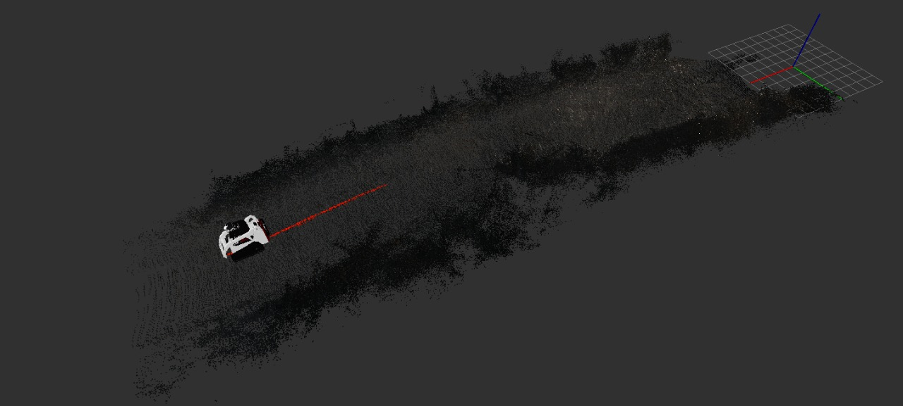

# Exploring RTABMAP for 3D LIDAR-based SLAM in Forestry Environments

The main objective of this work is to test and extend the 3D map representation of the environment using the RTABMAP approach. For this, leveraging of the dense 3D representation from two LIDARs mounted on the robot, as well as the existing cameras with different modalities has to be done (depth, multispectral,thermal) to provide colour information to the LIDAR point clouds, thus feeding RTABMAP with proper data, using the ROS framework



## Prerequisites

Inorder to build the project ROS packages, we need following things


* [Ubuntu 18.04, 64 bit LTS](https://releases.ubuntu.com/18.04.5/): The project software was tested in this version
* [ROS Melodic Desktop full installation](http://wiki.ros.org/melodic/Installation/Ubuntu): The entire project is based on ROS
* [Libpointmatcher: Install from source code for 18.04](https://libpointmatcher.readthedocs.io/en/latest/CompilationUbuntu/)
* [Install RTABMap from source](https://github.com/introlab/rtabmap/tree/0.20.0-melodic): We have to compile RTABMap using Libpointmatcher library. We can enable libpointmatcher library while building rtabmap. We have to use 0.20.0-melodic tag in the RTABMap inorder to work with this project.
* [Install RTABMap ROS from source](http://wiki.ros.org/rtabmap_ros): After installing RTABMap library, we have to setup RTABMap ROS package. This library is a ROS wrapper of RTABMap. We can clone the latest code in the master branch. If it giving error, switch to 0.20.0-melodic branch
* Install other ROS dependency packages using the following command

```
sudo apt install ros-melodic-perception ros-melodic-perception-pcl
```

## Installation
Here is the installation instructions of the project ROS packages

* Follow the [NTU Instruction](doc/NTU_instruction.pdf) for setting SEMFIRE project in your system
* Follow the steps inorder to setup the packages in this repo
```
# Create a ROS Workspace called sree_ws
mkdir -p ~/sree_ws/src

# Switch to src folder
cd ~/sree_ws/src

# Clone this package into src
git clone <link>

# Switch to workspace folder
cd ~/sree_ws

# Buid the workspace using catkin_make
catkin_make

#If everything build properly, add workspace path to .bashrc
echo "source ~/sre_ws/devel/setup.bash" >> ~/.bashrc
source ~/.bashrc

```

## Running Instruction

If you want to launch the RTAB Mapping on colourized pointcloud, you can execute the following commands

### RTAB Mapping from LIDAR

```
# Run semfire dataset bag file
roslaunch semfire_dataset_ntu run_dataset.launch with_odom_and_loc:=true

# Run the sreedevi odom launch file
roslaunch rtab_3d_lidar sreedevi_odom.launch

# Run pixel cloud fusion node to colourize the point cloud
roslaunch pixel_cloud_fusion pixel_cloud_fusion.launch

# Run rtab_3d_lidar launch file to run RTAB mapping on colorised point cloud
roslaunch rtab_3d_lidar rtab_3d_lidar.launch

# Run this launch file to visualize the mapping
roslaunch rtab_3d_lidar display_rviz.launch
```

### RTAB Mapping from Realsense

Inorder to run RTAB from realsense depth sensor, you can do the following command

```
# Run semfire dataset bag file
roslaunch semfire_dataset_ntu run_dataset.launch with_odom_and_loc:=true

# Run the sreedevi odom launch file
roslaunch rtab_3d_lidar sreedevi_odom.launch

# Run RTABMap on realsense
roslaunch rtab_3d_lidar rtab_realsense.launch"

# Run this launch file to visualize the mapping
roslaunch rtab_3d_lidar display_rviz.launch
```

## Author 
* Sreedevi Suresh
  
